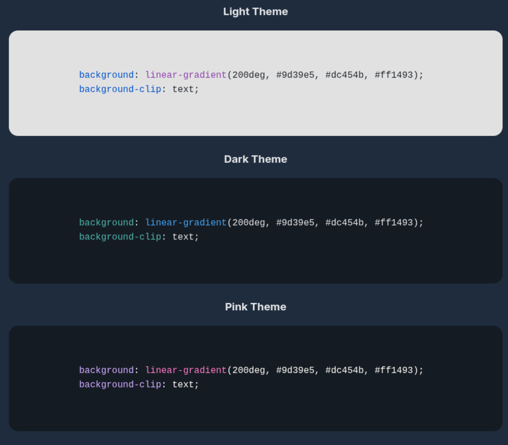

# Syntax Highlighting Component

✨ **Syntax Highlighting Component** is a customizable web component that makes your code snippets look beautiful and readable! 🚀

- Built with [Lit](https://lit.dev/) for fast and lightweight performance ⚡
- Uses [Prism.js](https://prismjs.com/) for accurate and colorful syntax highlighting 🎨
- Easy to use: just drop the component into your HTML and specify the language 📝
- Perfect for documentation, blogs, and developer portfolios 📚

Give your code blocks a professional touch with minimal effort! 💡

## Usage

To use the component, import it in your HTML file and use the `<syntax-highlight-component>` tag:

```html
<syntax-highlight-component language="css">
  background: linear-gradient(135deg, #9d39e5, #dc454b, #ff1493);
  background-clip: text;
</syntax-highlight-component>
```


